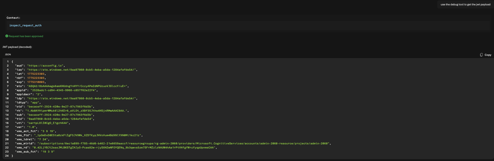

# MCP Toolbox

MCP Toolbox is a diagnostic MCP server for seeing exactly what a client or agent sends over the wire. It is useful when you need to validate MCP connectivity, inspect headers and tokens, confirm routing behavior, and test network or auth assumptions before you point an agent at a real backend.

By default, the service keeps risky HTTP diagnostics off: use `/mcp` for MCP traffic and `/healthz` for probes, with dashboard endpoints opt-in.

> [!WARNING]
> **Testing/troubleshooting use only. Use at your own risk.** This service can capture request headers, cookies, auth values, bodies, environment data, and recent call history. If you point real traffic at it, you may expose real tokens, secrets, or sensitive payloads. Keep it in trusted environments and assume anything sent to it may be inspected.

## Run locally with Docker

```bash
cd /path/to/MCP-Toolbox
docker build -t mcp-toolbox:local .
docker run --rm -p 8080:8080 mcp-toolbox:local
```

Local MCP URL:

- `http://127.0.0.1:8080/mcp`

## Quick start: deploy to Azure Container Apps with Bicep

Deploy it to Azure with the automated Bicep flow:

1. Log in to Azure CLI:

   ```bash
   az login
   ```

2. Copy `.env.example` to `.env` and set the values you care about. At minimum, most users only touch:
   - `APP_NAME`
   - `RESOURCE_GROUP`
   - `LOCATION`

   You can also set `ACR_NAME`, `CONTAINERAPPS_ENVIRONMENT`, `LOG_ANALYTICS_WORKSPACE_NAME`, `USER_ASSIGNED_IDENTITY_NAME`, `IMAGE_REPOSITORY`, and `IMAGE_TAG` if you want explicit control. If `ACR_NAME` is left blank, the script generates one for you.

3. Run the deployment script:

   ```bash
   ./scripts/deploy_bicep.sh
   ```

That script creates the Bicep-backed Azure resources, builds and pushes the container image, deploys the Container App, runs the smoke test, and prints the final MCP URL. It leaves the infrastructure running when it finishes.

For the manual Bicep flow, Terraform deployment, cleanup, existing-resource reuse, extra configuration knobs, and the full operator guide, see [README_advanced.md](./README_advanced.md).

## Available tools

| Tool | Purpose |
| --- | --- |
| `debug_request_context` | Full request/MCP snapshot including headers, auth material, query params, and body. |
| `inspect_request_auth` | Focused auth inspection for headers, cookies, query params, and decoded JWT claims. |
| `inspect_request_headers` | Shows the request headers exactly as the server received them. |
| `inspect_request_body` | Shows body size, decoded text, parsed JSON, and base64 preview when needed. |
| `inspect_request_summary` | Compact view of method, path, caller, and forwarding chain. |
| `inspect_mcp_envelope` | Shows the parsed MCP / JSON-RPC envelope. |
| `inspect_recent_calls` | Returns the recent captured call history from memory. |
| `inspect_runtime` | Returns runtime, process, version, uptime, and related server metadata. |
| `inspect_routes` | Lists the FastAPI routes and methods currently exposed. |
| `inspect_environment` | Returns environment variables, optionally filtered by prefix or name. |
| `get_server_info` | Returns high-level server identity and configuration details. |
| `echo_payload` | Round-trips arbitrary payload so you can compare sent vs received content. |
| `http_probe` | Makes an outbound HTTP request from inside the container. |
| `tls_probe` | Performs a TLS handshake and reports certificate and cipher details. |
| `tcp_probe` | Attempts a TCP connection and reports latency and socket details. |
| `dns_resolve` | Resolves DNS from inside the running container. |
| `decode_jwt` | Decodes a JWT-like token into header, payload, and signature segments. |
| `get_caller_ip` | Returns the caller IP the server observed. |
| `utc_now` | Returns the current UTC time from the running container. |
| `add_numbers` | Simple arithmetic sanity check for MCP call flow. |

## Using MCP Toolbox to test Foundry MCP authentication modes

MCP Toolbox is intentionally best used as an **unauthenticated diagnostic endpoint**. The value is that Foundry can still connect to it using any supported MCP auth mode (unauthenticated, key-based, Microsoft Entra identity modes, or OAuth identity passthrough), and this server shows you exactly what the incoming call looked like.

In other words: Foundry applies the auth mode, and MCP Toolbox gives you visibility into the resulting request (`inspect_request_headers`, `inspect_request_auth`, `debug_request_context`).

### Real-world applications

1. **Auth-mode validation before production** — connect the same agent with different Foundry auth settings and confirm the exact header/token shape that reaches the MCP endpoint.
2. **Onboarding failure triage** — when tool setup fails (timeouts, 401/403, wrong header format), inspect the real inbound request immediately instead of guessing where the break is.
3. **Security and policy verification** — prove that only expected auth/context data is being forwarded from Foundry before switching the agent to a real protected MCP backend.

### Sample usage in Foundry



Useful references:

- [Foundry MCP authentication options](https://learn.microsoft.com/en-us/azure/foundry/agents/how-to/mcp-authentication)
- [Foundry MCP tool documentation](https://learn.microsoft.com/en-us/azure/foundry/agents/how-to/tools/model-context-protocol)
- [Azure Functions MCP + Foundry auth examples](https://learn.microsoft.com/en-us/azure/azure-functions/functions-mcp-foundry-tools)
